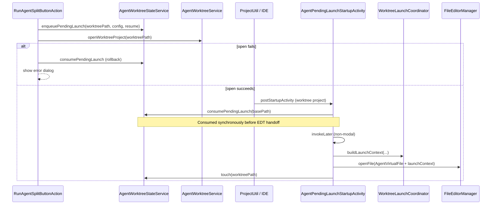
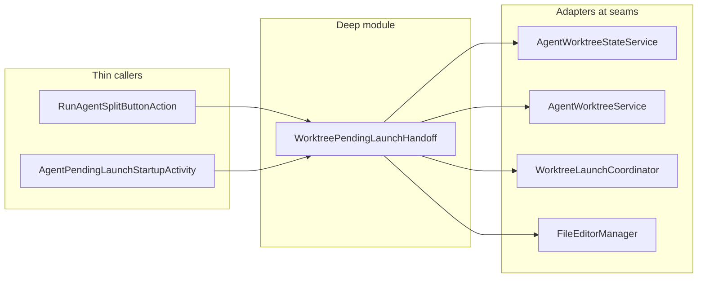

## Status

implemented

**Recommendation strength:** Speculative — the handoff works today; pain is maintainability and test locality, not a known user-facing defect. Prioritize only if worktree flows are being actively extended or if a handoff bug is reported.

## Problem Statement

Worktree agent launches that require opening a **different** IntelliJ `Project` (new worktree or open/resume existing worktree) cannot open `AgentVirtualFile` from the originating project. The plugin bridges this gap with a **pending launch** — a small persisted intent record keyed by worktree path — that is written before `ProjectUtil.openOrImport`, then consumed on the worktree project's `postStartupActivity`.

Today this cross-project handoff is **shallow and scattered**:

| Phase | Owner today | Responsibility |
| --- | --- | --- |
| Schedule | `RunAgentSplitButtonAction` (`RunAgentInNewWorktreeAction`, `OpenOrResumeWorktreeAction`) | `saveRecord` (new only), `enqueuePendingLaunch`, `openWorktreeProject`, rollback via `consumePendingLaunch` on open failure |
| Persist | `AgentWorktreeStateService` | `enqueuePendingLaunch` / `consumePendingLaunch` on app-scoped `agentWorktrees.xml` |
| Consume | `AgentPendingLaunchStartupActivity` | `consumePendingLaunch(project.basePath)`, validate configuration, `WorktreeLaunchCoordinator.buildLaunchContext`, open editor |
| Launch context | `WorktreeLaunchCoordinator` | Resume plan and `AgentLaunchContext` assembly (shared with in-project launch, but not handoff orchestration) |

The **interface** of the handoff — its invariants, error modes, ordering, and rollback — is implicit across four call sites. Callers must know the enqueue → open → consume sequence; the startup activity must know persistence field shapes; neither module documents the contract.

### Lifecycle (current)



### Friction (deep-module diagnosis)

1. **Low leverage at every seam.** `enqueuePendingLaunch` and `consumePendingLaunch` are thin persistence wrappers; orchestration (enqueue + open + rollback) is duplicated verbatim in two action classes. The deletion test fails: removing any one file does not eliminate complexity — it reappears in siblings.
2. **No locality for handoff invariants.** Examples not enforced in one place:
   - Pending launch must be rolled back when `openWorktreeProject` fails.
   - Consumption key must match the worktree path used at enqueue time (`project.basePath` ↔ normalized worktree path).
   - Configuration must still exist at consume time (validated only in startup activity).
   - `touch` timing differs: `OpenOrResumeWorktreeAction` touches before enqueue; `AgentPendingLaunchStartupActivity` touches after editor open.
3. **Fragile consume timing.** `consumePendingLaunch` runs synchronously in `runActivity` before `invokeLater`. If the project is disposed before the EDT runnable executes, the pending launch is gone and the agent tab never opens — with no error surface.
4. **No stale-launch policy.** A pending launch persists in `agentWorktrees.xml` indefinitely. There is no TTL, no cleanup on worktree deletion, and no re-queue path if consumption is lost.
5. **Untested handoff surface.** `AgentWorktreeStateServiceTest` covers session IDs only; no tests for enqueue/consume round-trip, rollback on open failure, or startup consumption. `RunAgentSplitButtonActionTest` covers split-button label only.

Contrast with **Run in Current Project**: `RunAgentInCurrentProjectAction` opens `AgentVirtualFile` directly — no handoff, no persistence, no startup hook. The two flows share `WorktreeLaunchCoordinator` for launch context but not orchestration, which invites drift.

## Solution

Introduce a **deep module** — `WorktreePendingLaunchHandoff` (name TBD during grilling) — that owns the full pending-launch **interface**: schedule, persist, consume, open editor, and error modes. Persistence remains an **adapter** at the seam (`AgentWorktreeStateService` or a narrowed `PendingLaunchStore` port); UI actions and startup activity become thin callers.

### Target interface (conceptual)

```kotlin
// Illustrative — final shape decided during implementation
object WorktreePendingLaunchHandoff {
    /** Enqueue intent, open worktree project, rollback enqueue on open failure. */
    fun scheduleLaunch(
        originatingProject: Project,
        worktreePath: String,
        configuration: AgentCliConfiguration,
        resume: Boolean,
    ): Result<Unit>

    /** Called from postStartupActivity; consume-if-present, open agent editor. */
    fun completePendingLaunchIfAny(project: Project)
}
```

**Leverage:** Callers pass intent; the module guarantees enqueue/open/rollback ordering, path-key consistency, configuration validation, launch-context assembly, and editor open. **Locality:** Handoff bugs and policy changes (TTL, dispose-safe consume) live in one module.

### Behavioural fixes bundled with deepening (optional, scope separately)

| Issue | Proposed policy |
| --- | --- |
| Consume-before-EDT | Defer consumption until inside `invokeLater` after `project.isDisposed` check, or use peek-then-ack pattern |
| Stale launches | Reject or auto-expire pending launches older than N hours; clear on worktree `markDeleted` |
| `touch` asymmetry | Single `touch` call at handoff completion (after successful editor open) |

These are improvements enabled by consolidation, not prerequisites for the refactor.

## User Stories

1. As a developer adding a new "open worktree" entry point, I want one function to schedule a cross-project agent launch, so I cannot forget enqueue, open, or rollback steps.
2. As a developer debugging "agent didn't open after worktree switch," I want handoff logic in one module with logged phases, so I can trace create → persist → consume → editor without reading four files.
3. As a developer changing resume behaviour, I want `WorktreeLaunchCoordinator` to remain the launch-context seam and the handoff module to delegate to it, so resume plan logic stays mode-agnostic.
4. As a maintainer, I want unit tests on the handoff interface (enqueue/consume round-trip, rollback on open failure, missing configuration at consume), so regressions are caught without IDE integration tests.
5. As a user creating a new worktree, I want the agent tab to open automatically in the worktree project with the same reliability as "Run in Current Project," so I don't land in an empty project wondering what happened.
6. As a user resuming a worktree session, I want the resume flag chosen in the dropdown to survive the project switch, so ACP session reload or PTY `--continue` applies correctly.
7. As a user whose agent configuration was deleted between scheduling and project open, I want a clear error dialog (existing behaviour), not a silent no-op.
8. As a reviewer, I want the handoff module's public surface to be ≤3 entry points, so the interface passes the depth test (small interface, substantial behaviour behind it).

## Implementation Decisions

### Ownership

- **Vertical slice:** `worktree/` — all affected files live in `com.oaalto.agent.worktree`.
- **No changes to** `pty/`, `acp/` (except call sites if any), or `settings/` beyond existing configuration lookup.

### Modules to modify

| Module | Change |
| --- | --- |
| **New: `WorktreePendingLaunchHandoff.kt`** | Deep module: `scheduleLaunch`, `completePendingLaunchIfAny`; owns ordering, rollback, validation, editor open |
| **`RunAgentSplitButtonAction.kt`** | Replace inline enqueue/open/rollback in `RunAgentInNewWorktreeAction` and `OpenOrResumeWorktreeAction` with `scheduleLaunch` |
| **`AgentPendingLaunchStartupActivity.kt`** | Thin delegate: `WorktreePendingLaunchHandoff.completePendingLaunchIfAny(project)` |
| **`AgentWorktreeStateService.kt`** | Keep `enqueuePendingLaunch` / `consumePendingLaunch` as persistence adapter; optionally add `peekPendingLaunch` if consume-deferred pattern is adopted |
| **`WorktreeLaunchCoordinator.kt`** | No orchestration changes; remains launch-context seam (called by handoff module) |
| **`AgentWorktreeService.kt`** | No changes; `openWorktreeProject` stays the IDE-open adapter |

### Seam layout (after)



### Invariants the deep module owns

1. **Path key:** Enqueue and consume use the same normalized path key (`AgentWorktreeStateSupport.normalizedPathKey`).
2. **Rollback:** If `openWorktreeProject` returns failure, pending launch is removed before returning error to caller.
3. **Idempotent enqueue:** Re-scheduling for the same worktree path replaces the previous pending launch (existing `enqueuePendingLaunch` behaviour).
4. **Configuration gate:** Missing configuration at consume time shows error dialog; does not open editor.
5. **Record touch:** `lastUsedAtEpochMs` updated once on successful handoff completion.

### ADR alignment

- **ADR 0001** (custom ACP client): No protocol changes. Handoff only affects when/where `AgentVirtualFile` opens. Aligned.
- **ADR 0002** (Kotlin ACP SDK): No SDK interaction. Aligned.
- **ADR 0003** (per-project agent selection): Handoff carries `configurationId` from the action that scheduled it; does not alter `AgentConfigurationSelector` semantics. Aligned.

## Testing Decisions

### What to test

- **Handoff interface (unit):**
  - `enqueue` + `consume` round-trip returns same `PendingLaunch` fields.
  - `scheduleLaunch` with mocked `openWorktreeProject` failure rolls back pending launch.
  - `completePendingLaunchIfAny` with missing configuration does not open editor (mock `FileEditorManager` or extract editor-open port).
  - Path normalization: enqueue at `C:\repo\wt` consumed when `project.basePath` differs only by separators/casing.
- **Regression:** Existing `WorktreeLaunchCoordinatorTest` and `AgentWorktreeStateServiceTest` continue to pass unchanged.
- **Optional integration:** Heavy; defer unless handoff bugs recur. Unit coverage on the deep module is the primary test surface.

### Modules to test

- **`WorktreePendingLaunchHandoffTest`** (new) — handoff orchestration with test doubles for `AgentWorktreeStateService`, `AgentWorktreeService`, and editor open.
- **`AgentWorktreeStateServiceTest`** — add pending-launch persistence tests (enqueue replaces duplicate, consume removes).

### Prior art

- `WorktreeLaunchCoordinatorTest` — pattern for building launch context without IDE.
- `AgentWorktreeStateServiceTest` — in-memory `loadState` round-trip for persistence.

### Verification

`./gradlew qualityGate` passes after implementation.

## Out of Scope

- Changing Git worktree creation/deletion (`AgentWorktreeGitSupport`).
- Redesigning the Run Agent split-button menu or worktree list UI.
- Merging pending launch with managed worktree records (separate concerns: intent vs. catalog).
- In-project "Run in Current Project" flow — no handoff involved.
- ACP session persistence (`acpSessionId`) — owned by worktree record lifecycle, not pending launch.
- IDE project-open mechanics (`ProjectUtil`, `OpenProjectTask` options).
- TTL / stale-launch cleanup — recommended follow-up; not required for initial deepening unless adopt consume-deferred pattern.

## Further Notes

- **Why speculative:** No open bug reports; current flow is ~40 lines of duplicated orchestration across two actions plus a 30-line startup activity. The refactor pays off when the handoff gains new entry points, policies, or tests — not as an urgent user fix.
- **Deletion test preview:** Removing `AgentPendingLaunchStartupActivity` without the deep module would lose consumption; removing `enqueuePendingLaunch` from actions without consolidation would duplicate rollback in every new caller. The deep module concentrates that complexity.
- **Naming:** During grilling, confirm whether `WorktreePendingLaunchHandoff` belongs as a standalone object or as methods on an expanded `WorktreeLaunchCoordinator`. Coordinator already owns launch *context*; handoff owns launch *orchestration across projects*. Keeping them separate preserves single responsibility at the seam.
- Implementers should update `CHANGELOG.md` under `### Changed` when the code ships.
- Related wiki: [Worktree subsystem](../wiki/subsystems/worktree.md) — update after implementation to document the handoff module and lifecycle.
