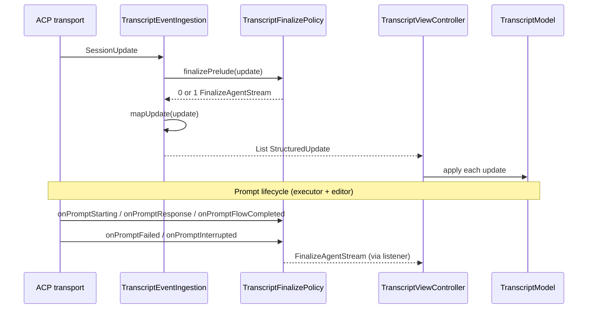

# ACP client subsystem

## Summary

The ACP client slice implements the Agent Client Protocol **client** in-process within the IntelliJ plugin. It owns the split UI (transcript column + prompt/shell bottom), the transcript rendering stack, session lifecycle, and the `ClientSessionOperations` bridge to the ACP agent subprocess. Entry point: `AcpAgentEditor`.

## Verified Facts

### Architecture

- `AcpAgentEditor` implements `FileEditor` and `Disposable`; it is the UI entry point for ACP mode.
- The plugin implements the ACP **client** in-process — it does **not** delegate sessions to JetBrains AI Chat (see ADR 0001).
- The ACP agent subprocess communicates via stdio JSON-RPC; the plugin is the client side.

### UI layout (`AcpEditorLayout`)

The root panel is a nested `Splitter`:

```
mainSplitter (TRANSCRIPT_SPLIT_RATIO = 0.72f)
├── transcriptColumn (left, 72%)
│   ├── transcriptArea (TranscriptPanel's JBScrollPane, CENTER)
│   ├── permissionPromptPanel (SOUTH)
│   └── authPromptPanel (NORTH)
└── bottomSplitter (right, 28%)
    ├── promptInputBar (top, PROMPT_SPLIT_RATIO = 0.2f)
    └── shellPaneHost (bottom, 80%)
transcriptFooter (SOUTH of mainSplitter)
```

- Layout split: ~72% transcript column / ~28% bottom (20% prompt input / 80% shell) per `AcpEditorLayout.buildRootPanel`.

### Transcript rendering stack

The transcript renders via a vertical `BoxLayout` column of block rows inside a `JBScrollPane`. Each `StructuredUpdate` flows through a fixed chain:

1. **`TranscriptViewController`** — EDT-safe bridge between `TranscriptModel` and `TranscriptPanel`. Public API: `apply(StructuredUpdate)`, `appendPlainLine()`, `appendError()`, `finalizeAgentStream()`.
2. **`TranscriptModel`** — holds `List<TranscriptBlock>`; emits blocks on updates.
3. **`TranscriptPanel`** — owns the `blockId` → row component reuse map; calls `TranscriptBlockViewFactory` to create/update/dispose rows inside a vertical `BoxLayout` column.
4. **`TranscriptBlockViewFactory`** — thin coordinator/registry: fixed adapter order (Tool → Plan → Agent text → Simple text), dispatches `create` / `update` / `dispose`, logs type-mismatch diagnostics. Stateless — no `blockId` map.
5. **Row adapters** (`TranscriptBlockRowAdapter`) — one implementation per block family: `ToolCallRowAdapter` (`CollapsibleToolPanel`), `PlanRowAdapter` (`PlanPanel`), `AgentTextRowAdapter` (body-part column + streaming fence normalize), `SimpleTextRowAdapter` (inline `JTextPane` presentation). Land in `acp/` during decomposition; move to `transcript/view/rows/` with package restructure.
6. **`TranscriptBodyPartWidgetMapper`** (planned) — shared view seam mapping `TranscriptBodyPart` → Swing widgets for agent rows and tool-card bodies; `BodyPartRenderProfile` distinguishes agent vs tool fallbacks.
7. **`TranscriptContentRenderer`** — deep module: markdown/plain text → `List<TranscriptBodyPart>` for agent rows and tool-card bodies (diff/terminal/image paths stay on `TranscriptToolCallContentRenderer`).
8. **`TranscriptRenderer`** — text extraction and plain-text formatters (not Swing view rendering); consumed by ingestion and rendering helpers.

### Prompt event routing

Events flow through ingestion (mapping) and policy (finalize prelude) before reaching the view:



- **`TranscriptEventIngestion.ingest(update)`** — prepends `TranscriptFinalizePolicy.finalizePrelude(update)`, then maps the update. Agent message chunks stream in place without finalization.
- **`notify()`** (`AcpClientSessionOperationsImpl`) routes `SessionUpdate` through `ingest()`.
- Prompt-edge finalize (`onPromptStarting`, `onPromptResponse`, `onPromptFlowCompleted`, `onPromptFailed`, `onPromptInterrupted`) is owned by **`TranscriptFinalizePolicy`**; callers are `AcpPromptExecutor` and `AcpAgentEditor`.

### Finalize policy (`TranscriptFinalizePolicy`)

Stateless orchestration module (ADR 0007). Decides *when* to emit `FinalizeAgentStream`; `TranscriptModel` decides *how* finalize mutates blocks.

| Hook | Caller | Rule |
| --- | --- | --- |
| `finalizePrelude(update)` | `TranscriptEventIngestion` | Finalize for every `SessionUpdate` except `AgentMessageChunk` — including variants that map to an empty list |
| `onPromptStarting()` | `AcpAgentEditor`, `AcpPromptExecutor` | Finalize before user echo / new prompt job |
| `onPromptResponse()` | `AcpPromptExecutor` | Finalize on `PromptResponseEvent` |
| `onPromptFlowCompleted()` | `AcpPromptExecutor` | Always finalize after `collect` — covers omitted `PromptResponseEvent` |
| `onPromptFailed()` | `AcpAgentEditor`, `AcpPromptExecutor` | Finalize before error surfacing |
| `onPromptInterrupted()` | `AcpPromptExecutor` | Finalize on `cancelPrompt` and `disposePromptWork` |

**Invariants:** (1) non-chunk session update finalizes before mapped update; (2) new prompt finalizes prior stream; (3) prompt flow end finalizes at least once; (4) failure/cancel/interrupt finalizes before idle; (5) redundant finalize is safe — model no-ops when no streaming block exists.

**Allowed direct `FinalizeAgentStream` construction:** `TranscriptFinalizePolicy`, `StructuredUpdate` definition, `TranscriptModel.apply` when-branch, `TranscriptViewController.finalizeAgentStream` (thin `apply` passthrough, not a policy owner), model/harness/adapter tests. Production ingestion, executor, and editor paths delegate to policy. Enforced in CI by `FinalizeAgentStreamConstructionTest`.

**Test seam:** `TranscriptFinalizePolicyTest` — table-driven lifecycle sequences. `TranscriptEventIngestionTest` retains mapping coverage.

### Session operations (deep module: `SessionFilesystemOperations`)

Filesystem policy is owned by `SessionFilesystemOperations` — a single deep module that concentrates scope → permission → VFS → line-slicing logic behind one seam.

- **`fsReadTextFile()` / `fsWriteTextFile()`** — delegated to `SessionFilesystemOperations`. The SDK adapter (`AcpClientSessionOperationsImpl`) maps sealed results to `ReadTextFileResponse` / `WriteTextFileResponse` / `JsonRpcException`.
- **`notify(notification, _meta)`** — routes `SessionUpdate` events through `TranscriptEventIngestion.ingest()`.
- **`requestPermissions()`** — delegates to `PermissionCoordinator.requestSessionPermission()`.
- **`terminalCreate()` / `terminalOutput()` / `terminalRelease()`** — manage terminal sessions via `TerminalSessionRegistry` and `ShellPaneHost`.

#### Composition root (`AcpClientSessionOperationsFactory`)

`AcpClientSessionOperationsFactory` (implemented by `AcpDefaultClientSessionOperationsFactory`) is the visible composition root for all `ClientSessionOperations` dependencies. `AcpSessionControllerImpl.openSession()` delegates to this factory rather than constructing dependencies inline.

#### VFS seam (`ScopedFileSystemAccess`)

`IdeScopedFileSystemAccess` is the production adapter behind the `ScopedFileSystemAccess` interface. An in-memory test adapter (`InMemoryScopedFileSystemAccess`) enables policy tests without IntelliJ platform fixtures.

#### Test surface

The deep module interface is the primary test seam — `SessionFilesystemOperationsTest` covers in-scope reads, out-of-scope rejections, permission denials, VFS read-only/ignored blocks, and line/limit slicing with the in-memory adapter.

**Transcript panel integration harness** (`TranscriptPanelTestHarness`, entry point `TranscriptPanelHarnessTest`):

- Mounted-panel seam below `AcpAgentEditor`: `StructuredUpdate` → `TranscriptModel` → `TranscriptPanel.sync` (default via `apply()`), or `syncBlocks()` for pure view regressions.
- `applyIngest(SessionUpdate)` exercises ingestion finalize-before-non-chunk policy through the same ViewController path.
- Headless-safe on EDT with `PlainMonospaceTranscriptCodeBlockViewFactory` and minimal `fakeTranscriptProject()`; `TranscriptViewController` accepts synchronous `runOnEdt` injection and exposes `panelForTest()` / `blocksForTest()`.
- Helpers: `scrollViewportToBottom`/`ToTop`, `verticalScrollBarValue`, `assertSingleTranscriptScrollPane` (vertical scroll ownership), `assertNoHorizontalScrollbar` (tree walk + policy), `codeBlockPreferredHeights`, `rowPreferredHeights`, `blocks()`, `dispose()`.
- Golden scenarios (ViewController `apply` path): chunked streaming + finalize + code-block height, stick-to-bottom on append, single vertical scroll owner, column resize reflow, mixed tool + agent rows; plus ingestion finalize-before-tool ordering via `applyIngest`.
- Row-adapter unit tests (`TranscriptBlockViewFactoryTest`, `*RowAdapterTest`) complement the harness; update harness scenarios when panel-level behaviour changes.
- Deferred: JSON golden sequences in test resources; fence-normalization panel scenario after `acp-transcript-fence-normalization` lands.

### Event ingestion (`TranscriptEventIngestion`)

Maps `SessionUpdate` → `StructuredUpdate`; delegates finalize prelude to `TranscriptFinalizePolicy` (see above). Does **not** own prompt-edge finalize rules.

- **Agent/user/thought chunks** → `AppendAgentText`, `AppendUserEcho`, `AppendThought`.
- **Tool calls** → tool call start/delta/end variants.
- **`UsageUpdate`** → `StructuredUpdate.Usage` (feeds `TranscriptFooter`).
- **`AvailableCommandsUpdate`** → `StructuredUpdate.AvailableCommands` (feeds slash-command autocomplete).
- **Plan events** (`PlanUpdate`, `PlanUpdateV2`, `PlanRemoved`) → plan panel variants via `PlanUpdateMapper`.

### Structured updates (`StructuredUpdate`)

The transcript uses a sealed hierarchy of `StructuredUpdate` variants:

- `AppendPlainLine(line, isUserPrompt)` — plain text line (user prompts start with `> `).
- `AppendError(message)` — error message.
- `FinalizeAgentStream` — finalizes the active agent stream.
- `AvailableCommands(commands)` — updates `PromptInputBar` slash-command list.
- `Usage(used, size, cost)` — cumulative token usage and optional cost for the footer.
- Tool call variants (tool call start, delta, end).
- Plan variants (plan start, step updates, removal).

### Theme-aware colors (`TranscriptColorProvider`)

- Central color authority for transcript HTML and Swing components; adapts to IDE light/dark theme via `JBColor`.
- Registered as an IntelliJ service; `DefaultTranscriptColorProvider` is the fallback.
- Used by `TranscriptRenderer`, `PlanPanel`, badges, and tool cards for consistent theming.

### Content rendering (`TranscriptContentRenderer`)

- Canonical seam: `renderMarkdownText(text, options)` → ordered `List<TranscriptBodyPart>` for both `FinalAgentText` rows and completed tool-card text bodies.
- One markdown parse pipeline (IntelliJ `org.intellij.markdown`, GFM flavour) behind the module; internal `RenderedBlock` AST is package-private. Agent and tool rows consume the same body-part stream; `TranscriptBodyPartWidgetMapper` (block-view decomposition) unifies part → widget mapping with profile-specific fallbacks.
- `ContentRenderOptions` carries truncation ceiling, highlighted-code budget, fence-normalization flag (`applyFenceNormalization`), and optional markdown heuristic skip for plain tool dumps. Agent rows use `AGENT_TEXT`; tool text uses `forToolMarkdownText` (normalizes when markdown-like).
- Fence normalization runs **only** in `TranscriptContentRenderer` (final/tool markdown) and `AgentTextRowAdapter` (streaming plain text) — both call `normalizeAgentFences` in `TranscriptAgentFenceNormalizer`. `TranscriptMarkdownRenderer.parseToBlocks` does not normalize. CI allowlist: `AgentFenceNormalizationConstructionTest`.
- Replaces the retired `segmentFencedCodeBlocks` / `TextSegment` approach.
- Fenced code blocks use embedded read-only Editors (`EditorFactoryTranscriptCodeBlockViewFactory`); `measureTranscriptEditorCodeBlockSize` sizes them at creation (font-metrics fallback when `lineHeight` is 0 before first paint) and `applyTranscriptCodeBlockWidth` reflows on transcript column resize; `AgentTextRow` remeasures on EDT after markdown rebuild.
- Agent stream finalizes via `TranscriptFinalizePolicy` when the prompt flow completes (`AcpPromptExecutor`), not only on `PromptResponseEvent`.
- `normalizeAgentFences` splits inline closing fences (`code```Example`), merged opening fences (` ```kotlinfun main()`), prose-before-fence on the same line (`Main.kt:```kotlinfun`), citation-style `line:line:path` headers, and auto-closes trailing unclosed fences. Idempotent on valid GFM; accepts `\r\n` input; streaming callers re-normalize the full accumulated buffer each bind.
- `joinCodeFenceParts` preserves line breaks when the markdown parser emits separate text nodes inside a fence.
- Read-only code block Editors are focusable for text selection.

### Plan visualization (`PlanPanel`, `PlanPanelRenderer`)

- `PlanUpdate` / `PlanUpdateV2` render as in-transcript checklist panels keyed by plan ID.
- Status icons: pending `[ ]`, in-progress `[→]`, completed `[✓]` with gray/orange/green styling.
- Priority: HIGH (bold + red left border), LOW (muted gray).
- Progress summary: "N of M completed" (green when fully complete).
- `PlanRemoved` removes the panel; `PlanVariant.File` and `Markdown` have fallback rendering.
- In-place updates by plan ID via `TranscriptModel` plan tracking.

### Transcript footer (`TranscriptFooter`)

- Sticky status bar at the bottom of the transcript column (SOUTH of `mainSplitter`).
- Displays cumulative token usage (`used / size`) and optional cost from `UsageUpdate` events.
- Usage label turns orange when `used / size > 0.8`; cost label hidden when null.

### Slash-command autocomplete (`PromptInputBar`, `SlashCommandMatcher`)

- `AvailableCommandsUpdate` populates `SlashCommand` list on the prompt input bar.
- Typing `/` opens a popup (max 5 visible rows, width matches prompt field, positioned above input).
- Up/Down highlight commands while keeping focus in the prompt field; Tab completes selection.
- Filtering updates the list in place as the user types.

### Threading

- All transcript mutations are marshalled onto the EDT (Event Dispatch Thread) via `runOnEdt` callback or `SwingUtilities.invokeLater()`.
- `TranscriptViewController` accepts an optional `runOnEdt` parameter; defaults to `SwingUtilities.invokeLater` when not provided.
- The ACP agent subprocess communicates on IO threads; `ClientSessionOperations` methods are `suspend` functions that marshal results back to the EDT via the listener.

## Agent Synthesis

- When changing transcript behavior, start at `AcpAgentEditor.kt` and trace the flow: ACP events enter via `TranscriptEventIngestion` (finalize prelude from `TranscriptFinalizePolicy`) or `notify()` via `AcpClientSessionOperationsImpl`, map to `StructuredUpdate`, then flow through `TranscriptViewController` → `TranscriptModel` → `TranscriptPanel`.
- Live agent streaming uses `TranscriptBlock.StreamingAgentText` with fence normalization and the `CURSOR_CHAR` indicator in `AgentTextRowAdapter`; finalized agent text becomes `FinalAgentText` and routes through `TranscriptContentRenderer`.
- Layout split is hard-coded: 72% transcript / 28% bottom, 20% prompt / 80% shell.
- The ACP client is in-process (not JetBrains AI Chat); the agent subprocess is a separate process communicating via stdio JSON-RPC.

## Related

- [Domain context & ACP transcript model](../concepts/context.md)
- [Architecture decisions map](architecture.md)
- [Agent CLI overview](../concepts/agent-cli-overview.md)
- [Worktree subsystem](worktree.md)
